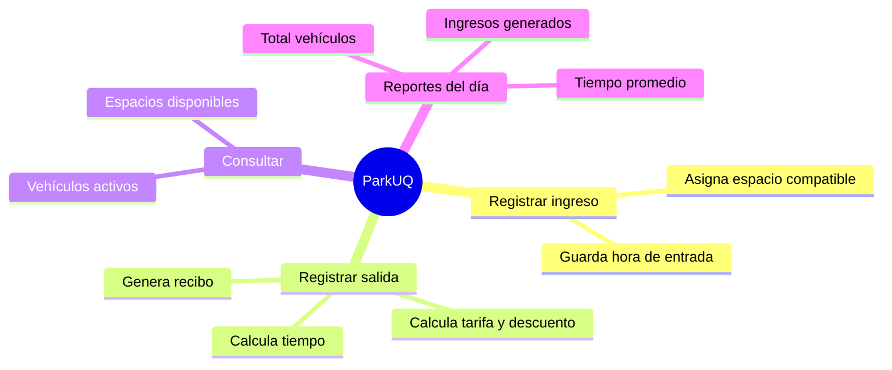

# 01 — Visión general

> [!info] En una frase
> **ParkUQ es un sistema de escritorio (JavaFX) para gestionar el parqueadero de la Universidad del Quindío:** registra entradas y salidas de vehículos, asigna espacios, calcula tarifas con descuentos y genera reportes del día.

---

## El problema que resuelve

El parqueadero operaba **manualmente**, lo que generaba errores en:
- el control del tiempo de cada vehículo,
- la disponibilidad de espacios,
- el cálculo de tarifas y descuentos.

ParkUQ automatiza todo eso.

---

## ¿Qué hace? (4 funciones núcleo)

---

## Dos roles de usuario

| Rol | Qué puede hacer | Credenciales de prueba |
|---|---|---|
| **Operador** | Registrar ingresos/salidas, consultar, generar reporte | `operador` / `1234` |
| **Administrador** | Gestionar espacios, configurar tarifas, administrar usuarios autorizados | `admin` / `admin` |

> [!tip] Para la exposición
> Estos dos roles son un ejemplo de **control de acceso**: tras autenticarse, el sistema muestra SOLO las funciones del rol correspondiente. Cada rol tiene su propia pantalla (`operador.fxml` y `admin.fxml`).

---

## ¿Quién usa cada cosa?

- El **operador** es quien está en la caseta todo el día: ve entrar y salir vehículos.
- El **administrador** configura el sistema: cuántos espacios hay, cuánto cuesta la hora, qué usuarios tienen descuento.

---

## Datos con los que arranca el sistema

Cuando abres la app, ya viene "sembrada" con datos de prueba (ver `AppParkUQ.java`):

- **25 espacios**: 10 para carros (`C-01`…`C-10`), 10 para motos (`M-01`…`M-10`), 5 para bicis (`B-01`…`B-05`).
- **Tarifas por hora**: Carro $3.000, Moto $2.000, Bici $500.
- **2 usuarios del sistema**: el operador y el admin.

> [!note] Importante para entender
> Los datos NO se guardan en una base de datos ni en archivos. Viven en **memoria** mientras la app está abierta. Si cierras la app, todo vuelve a los valores iniciales. Esto es normal y suficiente para Programación I.

---

🔗 Siguiente: [[02 - Arquitectura en capas]]
