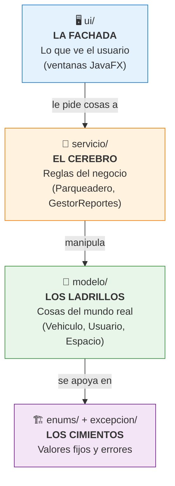

# 02 — Arquitectura en capas

> [!important] Esto es lo MÁS importante que te puede preguntar el profesor
> El proyecto está organizado en **capas**, donde cada capa tiene UNA sola responsabilidad. A esto se le llama **separación de responsabilidades** (*separation of concerns*).

---

## 🏛️ Analogía del edificio

Piensa en el proyecto como un edificio donde cada piso hace una sola cosa:

---

## Qué hay en cada capa

### 🖥️ `ui/` — La interfaz (JavaFX)
Lo que ve y toca el usuario. **No sabe NADA de reglas de negocio.**

- `AppParkUQ.java` → punto de entrada. Arranca la app y siembra los datos.
- `controlador/` → reciben los clics y se los pasan al servicio:
  - `LoginControlador` (autenticación)
  - `OperadorControlador` (ingresos, salidas, consultas, reportes)
  - `AdminControlador` (espacios, tarifas, usuarios)
- `vista/` → archivos `.fxml`: el diseño visual de cada pantalla.

> [!example] Patrón MVC
> La carpeta `ui` usa el patrón **Modelo-Vista-Controlador**: la **Vista** (`.fxml`) define cómo se ve; el **Controlador** (`.java`) define qué pasa al hacer clic; el **Modelo** son las clases de `modelo/`.

### 🧠 `servicio/` — La lógica de negocio
El cerebro. Aquí viven las REGLAS: cómo se asigna un espacio, cómo se calcula una tarifa, cómo se genera un reporte.

- `Parqueadero.java` → **el objeto central**. Contiene todas las listas (espacios, vehículos, tarifas…) y ejecuta las operaciones.
- `GestorReportes.java` → calcula estadísticas del día.

### 🧱 `modelo/` — Las entidades
Las "cosas" del problema real, convertidas en objetos:
`Vehiculo`, `Usuario`, `EspacioParqueadero`, `Tarifa`, `RegistroSalida`, `UsuarioSistema`.

### 🏗️ `enums/` + `excepcion/` — La base
- `enums/` → conjuntos de valores fijos (ver [[03 - Los 4 pilares de la POO]]).
- `excepcion/` → errores controlados del dominio.

---

## ¿Por qué importa tener capas? (la pregunta clave)

> [!question] "¿Por qué no pusiste todo en una sola clase?"
> Porque cada capa puede cambiar **sin romper** las demás:
> - Si mañana cambias JavaFX por una **página web**, solo reescribes `ui/`. El cerebro (`servicio` + `modelo`) queda intacto.
> - Los **tests** prueban `servicio` y `modelo` sin necesidad de abrir ninguna ventana.
> - Es más fácil de **entender y mantener**: si hay un bug en el cálculo de tarifas, sabes que está en `servicio`, no en la interfaz.

---

## La regla de oro de la dependencia

> [!warning] Las flechas SIEMPRE apuntan hacia adentro
> La `ui` conoce al `servicio`. El `servicio` conoce al `modelo`. Pero **nunca al revés**: el `modelo` no sabe que existe una interfaz gráfica. Esto mantiene el núcleo del sistema independiente de la tecnología de presentación.

---

🔗 Anterior: [[01 - Visión general]] · Siguiente: [[03 - Los 4 pilares de la POO]]
