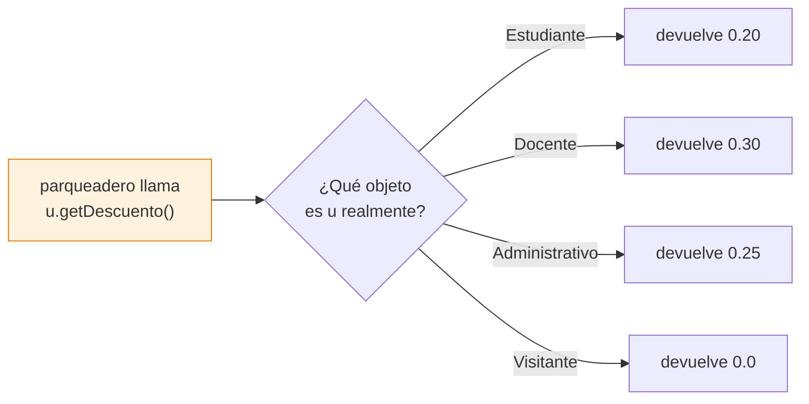

# 03 — Los 4 pilares de la POO

> [!important] El corazón de tu exposición
> Tu materia es Programación I y el tema es **Programación Orientada a Objetos**. ParkUQ demuestra los 4 pilares A PROPÓSITO. Aprende cada uno CON su ejemplo concreto del proyecto.

| Pilar | Dónde está en ParkUQ |
|---|---|
| 🎭 Abstracción | `abstract class Vehiculo`, `abstract class Usuario` |
| 🧬 Herencia | `Carro extends Vehiculo`, `Estudiante extends Usuario` |
| 🔄 Polimorfismo | `getDescuento()`, `getTipoDescripcion()` |
| 🔒 Encapsulamiento | atributos `private` + getters/setters + copias defensivas |

---

## 🎭 Pilar 1: ABSTRACCIÓN

> Definir **QUÉ** debe hacer algo, sin decir **CÓMO**.

En `Vehiculo.java`:

```java
public abstract class Vehiculo {
    // ...atributos comunes: placa, conductor, hora...
    public abstract String getTipoDescripcion();   // ← prometo que existe, NO lo implemento
}
```

La palabra `abstract` hace dos cosas:
1. **No puedes hacer `new Vehiculo(...)`** → error de compilación. Un vehículo "genérico" no existe en la realidad; existe un carro, una moto, una bici.
2. **Obliga** a cada subclase a implementar `getTipoDescripcion()`. Es un **contrato**.

> [!example] 🏗️ Analogía
> `abstract class Vehiculo` es como el plano de "vivienda". Nadie vive en "una vivienda" abstracta: vives en una casa o un apartamento concreto. El plano define qué debe tener toda vivienda, pero cada tipo lo resuelve a su manera.

> [!quote] Cómo lo dices en la exposición
> *"Usé una clase abstracta porque ningún vehículo es genérico. Defino lo común una sola vez y obligo a cada subtipo a definir su propia descripción."*

---

## 🧬 Pilar 2: HERENCIA

> Una clase hija **reutiliza** lo de la padre y le añade lo suyo.

Mira lo corto que es `Carro.java`:

```java
public class Carro extends Vehiculo {
    public Carro(String placa, String nombreConductor, String identificacionConductor) {
        super(placa, TipoVehiculo.CARRO, nombreConductor, identificacionConductor);
    }
    @Override
    public String getTipoDescripcion() { return "Automóvil"; }
}
```

- `extends Vehiculo` significa **"es un"**: un Carro **es un** Vehiculo.
- `Carro` NO repite `placa`, `nombreConductor`, etc. → **los hereda**.
- `super(...)` llama al constructor del padre para inicializar lo heredado.
- `Carro` fija `TipoVehiculo.CARRO` automáticamente.

**El caso interesante — `Motocicleta` añade lo suyo:**

```java
public class Motocicleta extends Vehiculo {
    private int cilindraje;   // ← atributo PROPIO, solo de la moto
    // ...
}
```

> [!example] 🏗️ Analogía
> No rediseñas los cimientos para cada casa del barrio. Tienes un plano base y cada casa lo extiende con sus detalles. La moto "extiende" el plano del vehículo agregando el cilindraje.

> [!tip] Herencia bien usada
> **Hereda lo común, agrega lo específico.** La moto tiene cilindraje; el carro y la bici no lo necesitan, así que no lo tienen.

---

## 🔄 Pilar 3: POLIMORFISMO

> El **mismo método**, llamado igual, se comporta **distinto** según el objeto.

Este es el pilar estrella. Los cuatro tipos de usuario tienen `getDescuento()`, pero cada uno responde diferente:

| Clase | `getDescuento()` |
|---|---|
| `Estudiante` | `0.20` (20%) |
| `Administrativo` | `0.25` (25%) |
| `Docente` | `0.30` (30%) |
| `Visitante` | `0.0` (0%) |

Ahora la MAGIA, en `Parqueadero.java` (`buscarDescuentoConductor`):

```java
for (Usuario u : usuariosAutorizados) {
    if (u.getIdentificacion().equals(identificacion)) {
        return u.getDescuento();   // ← ¿estudiante? ¿docente? NO LO SÉ NI ME IMPORTA
    }
}
```

> [!success] Lo brillante
> **No hay un solo `if (es estudiante) ... else if (es docente)`.** Solo `u.getDescuento()`, y Java ejecuta la versión correcta según el objeto real en tiempo de ejecución.



> [!question] ¿Por qué es tan valioso?
> Si mañana agregas un `Egresado` con 15%, creas la clase `Egresado extends Usuario` con su `getDescuento()` y **NO TOCAS `Parqueadero` para nada**. Esto es el **Principio Abierto/Cerrado**: abierto a extensión, cerrado a modificación.

> [!quote] LA frase para la exposición
> *"El polimorfismo me permitió eliminar los condicionales. El parqueadero pide el descuento sin saber qué tipo de usuario es; cada subclase responde lo suyo. Agregar un nuevo tipo no obliga a modificar la lógica existente."*

---

## 🔒 Pilar 4: ENCAPSULAMIENTO

> Los datos están **protegidos**; solo se accede por métodos controlados.

Todos los atributos son `private` (ej. `EspacioParqueadero.java`):

```java
private String codigo;
private EstadoEspacio estado;
```

Nadie puede hacer `espacio.estado = OCUPADO` desde fuera. Y mira por qué importa — `asignarVehiculo()`:

```java
public void asignarVehiculo(Vehiculo vehiculo) {
    this.vehiculoAsignado = vehiculo;
    this.estado = EstadoEspacio.OCUPADO;   // ← cambia DOS cosas de forma coherente
}
```

> [!tip] ¿Por qué un método y no un setter simple?
> Porque asignar el vehículo y marcar OCUPADO **deben pasar siempre juntos**. Si lo dejaras suelto, alguien podría asignar el vehículo pero olvidar marcar ocupado → bug. El encapsulamiento **garantiza la coherencia**.

**Nivel avanzado — copia defensiva en `Parqueadero.java`:**

```java
public List<EspacioParqueadero> getEspacios() {
    return new ArrayList<>(espacios);   // ← devuelve una COPIA, no la lista real
}
```

> [!success] Detalle que casi nadie hace en Programación I
> Si devolviera la lista original, alguien podría hacer `getEspacios().clear()` y borrar todos los espacios. Al devolver una **copia defensiva**, los datos internos quedan blindados. **Si explicas esto, ganas puntos.**

> [!example] 🏗️ Analogía
> El cajero del banco. No metes la mano en la bóveda (atributos `private`); le pides al cajero (métodos `public`) y él, con sus reglas, te entrega lo tuyo.

---

## 🎁 Bonus: la herencia también está en las EXCEPCIONES

Ver [[05 - Flujos principales]] y `excepcion/`. Todas las excepciones del dominio heredan de `ParkUQException`:

```java
public class PlacaDuplicadaException extends ParkUQException { ... }
```

Esto permite atrapar las TRES de un golpe (`OperadorControlador.java`):

```java
} catch (ParkUQException e) {   // ← atrapa la PADRE y todas sus hijas
    etiquetaResultadoIngreso.setText("Error: " + e.getMessage());
}
```

> [!note] Polimorfismo aplicado a errores
> Con un solo `catch (ParkUQException)` capturas placa duplicada, sin espacio y vehículo no encontrado, porque todas "son una" `ParkUQException`.

---

🔗 Anterior: [[02 - Arquitectura en capas]] · Siguiente: [[04 - Diagrama de clases explicado]]
