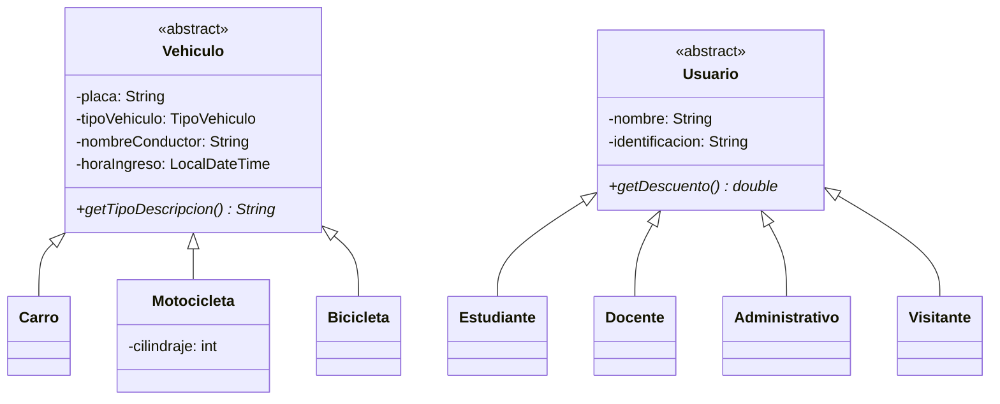
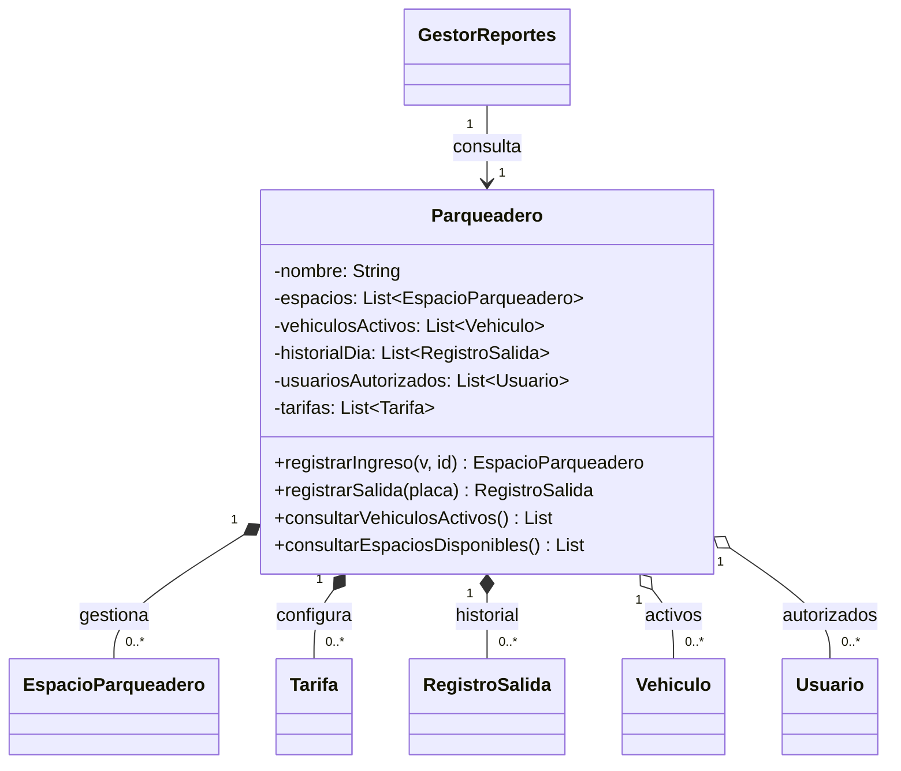
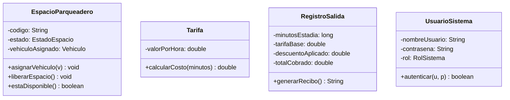

# 04 — Diagrama de clases explicado

> [!info] Objetivo
> Entender QUÉ clases hay y, sobre todo, **CÓMO se relacionan**. El proyecto original tiene el diagrama en `parkuq.puml`; aquí lo explicamos parte por parte con Mermaid.

---

## Las dos jerarquías de herencia

> [!note] El `*` y `<<abstract>>`
> El asterisco marca un método **abstracto** (sin cuerpo, obligatorio de implementar). `<<abstract>>` marca que la clase no se puede instanciar directamente. Ver [[03 - Los 4 pilares de la POO]].

---

## El objeto central: `Parqueadero`

`Parqueadero` es la **raíz de composición**: contiene todas las listas del sistema y ejecuta las operaciones.

---

## ⭐ Composición vs Agregación (PREGUNTA CLÁSICA DE EXAMEN)

Las dos significan "una clase contiene a otra", pero la diferencia es **quién es dueño del ciclo de vida**.

| | Composición `*--` | Agregación `o--` |
|---|---|---|
| Símbolo UML | rombo **relleno** ◆ | rombo **vacío** ◇ |
| Significado | "es **parte de**" | "**usa / tiene**" |
| Ciclo de vida | Si muere el todo, mueren las partes | Las partes existen por su cuenta |
| Ejemplo en ParkUQ | `Parqueadero *-- EspacioParqueadero` | `Parqueadero o-- Vehiculo` |

> [!example] La analogía que lo deja claro
> - **Composición** = un cuerpo y sus órganos. Si el cuerpo muere, el corazón no sigue funcionando solo. → Los **espacios** no tienen sentido sin el parqueadero.
> - **Agregación** = un equipo de fútbol y sus jugadores. Si el equipo se disuelve, los jugadores siguen existiendo. → Un **vehículo** existe aunque no esté en el parqueadero.

> [!question] "¿Por qué los espacios son composición y los vehículos agregación?"
> Porque los **espacios** se crean dentro del parqueadero y no existen fuera de él (son su estructura física). Los **vehículos** llegan de la calle, entran y se van: existen independientemente del parqueadero.

---

## Clases de apoyo

- **`EspacioParqueadero`** → un cajón del parqueadero. Sabe si está libre y a quién tiene asignado.
- **`Tarifa`** → cuánto cuesta la hora de cada tipo. Tiene la fórmula del costo. Ver [[05 - Flujos principales]].
- **`RegistroSalida`** → el "recibo" generado al salir. Guarda todos los valores calculados.
- **`UsuarioSistema`** → ≠ `Usuario`. Este es para LOGIN (operador/admin). El otro es el conductor con descuento. **¡No los confundas!**

> [!warning] Trampa frecuente: `Usuario` vs `UsuarioSistema`
> - `Usuario` (abstracto) = el **conductor** del vehículo, que puede tener descuento (Estudiante, Docente…).
> - `UsuarioSistema` = quien **inicia sesión** en la app (operador o admin).
> Son cosas totalmente distintas con nombres parecidos.

---

## Las enumeraciones (`enum`)

Son conjuntos **cerrados** de valores fijos. Ver por qué en [[07 - Preguntas y respuestas de exposición]].

| Enum | Valores |
|---|---|
| `TipoVehiculo` | CARRO, MOTOCICLETA, BICICLETA |
| `TipoEspacio` | CARRO, MOTOCICLETA, BICICLETA |
| `EstadoEspacio` | DISPONIBLE, OCUPADO, FUERA_DE_SERVICIO |
| `EstadoVehiculo` | DENTRO, SALIO |
| `TipoUsuario` | ESTUDIANTE, DOCENTE, ADMINISTRATIVO, VISITANTE |
| `RolSistema` | OPERADOR, ADMINISTRADOR |

---

🔗 Anterior: [[03 - Los 4 pilares de la POO]] · Siguiente: [[05 - Flujos principales]]
