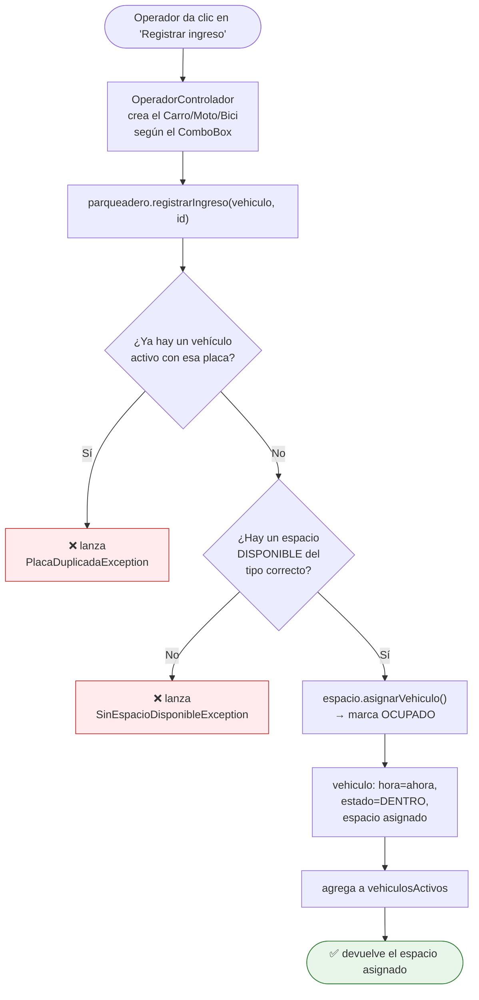
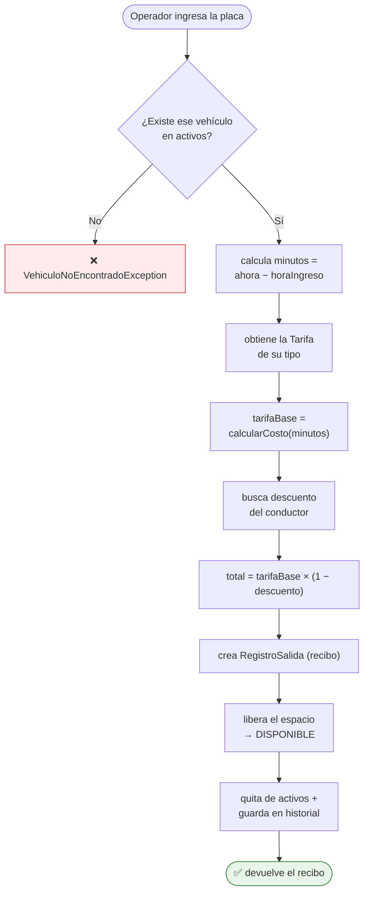
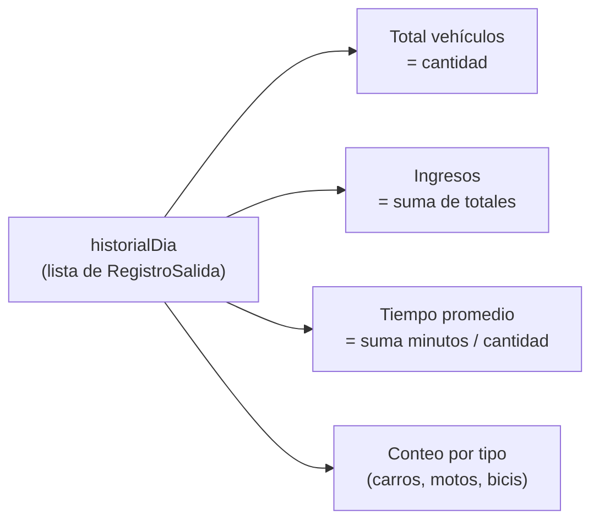

# 05 — Flujos principales

> [!info] Objetivo
> Seguir, paso a paso, qué pasa por dentro cuando ocurre cada operación. Si entiendes estos dos flujos (ingreso y salida), entiendes el 80% del sistema.

---

## 🟢 Flujo A — Registrar INGRESO

Método: `Parqueadero.registrarIngreso(vehiculo, idConductor)`



> [!note] Las dos validaciones
> 1. **Placa duplicada**: no puede entrar dos veces el mismo vehículo.
> 2. **Espacio disponible**: debe haber un cajón libre del tipo correcto (un carro no cabe en espacio de moto).

---

## 🔴 Flujo B — Registrar SALIDA (el más importante)

Método: `Parqueadero.registrarSalida(placa)`



### 💰 La fórmula de la tarifa (memorízala)

En `Tarifa.calcularCosto(minutos)`:

```java
double horas = minutos / 60.0;
double horasEfectivas = Math.max(1.0, horas);   // ← mínimo 1 hora
return horasEfectivas * valorPorHora;
```

Y en `Parqueadero`:

$$ \text{total} = \underbrace{\max(1, \tfrac{minutos}{60}) \times valorHora}_{\text{tarifaBase}} \times (1 - descuento) $$

> [!example] Ejemplo numérico
> Un **docente** (30% descuento) deja su **carro** ($3.000/hora) durante **90 minutos**:
> - horas = 90/60 = 1.5 → horasEfectivas = max(1, 1.5) = **1.5**
> - tarifaBase = 1.5 × 3.000 = **$4.500**
> - total = 4.500 × (1 − 0.30) = **$3.150**

> [!tip] El "mínimo 1 hora" es una regla de negocio
> Aunque el vehículo esté 5 minutos, se cobra 1 hora completa. `Math.max(1.0, horas)` lo garantiza. Es una decisión de diseño que debes saber justificar: refleja cómo cobran los parqueaderos reales.

---

## 📊 Flujo C — Reporte del día

Lo hace `GestorReportes.generarResumenDia()`. Recorre el `historialDia` y calcula:



> [!note] GestorReportes no guarda datos
> Recibe el `Parqueadero` por el constructor (inyección de dependencia) y solo **lee** sus datos para calcular. No duplica información. Ver [[02 - Arquitectura en capas]].

---

## 🧾 El recibo y la inmutabilidad

`RegistroSalida` tiene todos sus campos `final` y **no tiene setters**:

```java
private final double totalCobrado;   // no se puede cambiar después de crearlo
```

> [!success] ¿Por qué inmutable?
> Un recibo, una vez emitido, **no debe cambiar**. Hacerlo inmutable evita que por error se modifique un cobro ya registrado. Es otra buena práctica que suma en la exposición.

---

🔗 Anterior: [[04 - Diagrama de clases explicado]] · Siguiente: [[06 - Cómo ejecutar y demostrar]]
