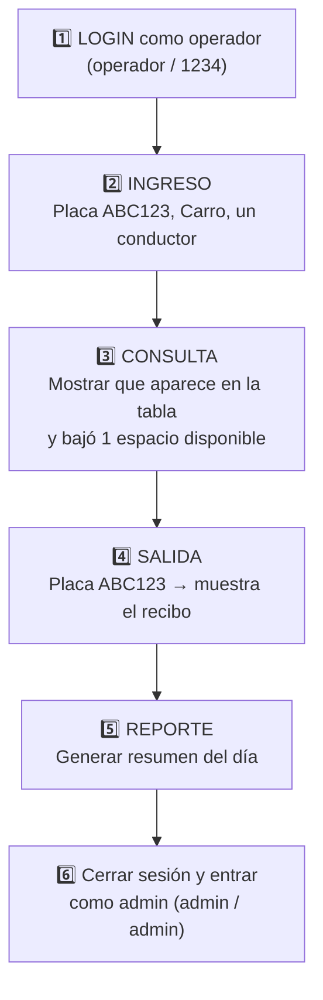

# 06 — Cómo ejecutar y demostrar

> [!warning] Lo PEOR en una exposición es que el proyecto no arranque
> Practica esto ANTES, al menos una vez, en el computador donde vas a exponer.

---

## Requisitos

| Herramienta | Versión |
|---|---|
| JDK | 21 o superior |
| IntelliJ IDEA | Community o Ultimate |
| Librerías | JavaFX 21 + JUnit 5 (se agregan como dependencias) |

---

## Pasos para ejecutar (resumen)

> [!note] Detalle completo en el `README.md` del proyecto
> Aquí va lo esencial para no perderte.

1. **Abrir** el proyecto en IntelliJ.
2. **Configurar el SDK** (JDK 21) en *File → Project Structure → SDK*.
3. **Agregar dependencias** (*Libraries → + → From Maven*):
   - `org.openjfx:javafx-controls:21`
   - `org.openjfx:javafx-fxml:21`
   - `org.openjfx:javafx-graphics:21`
   - `org.openjfx:javafx-base:21`
   - `org.junit.jupiter:junit-jupiter:5.10.2`
4. **Configurar ejecución** (*Run → Edit Configurations → + → Application*):
   - Main class: `trabajoFinal.ui.AppParkUQ`
   - VM options (¡cambia `TU_USUARIO`!):
     ```
     --module-path "RUTA_A_LOS_JAR_DE_JAVAFX" --add-modules javafx.controls,javafx.fxml
     ```
5. **Run** (▶ o `Shift + F10`).

> [!tip] Si falla con "JavaFX runtime components are missing"
> Es el error #1 con JavaFX. Significa que las **VM options** del module-path están mal o faltan. Revisa que la ruta a los `.jar` de JavaFX sea correcta y que esté `--add-modules javafx.controls,javafx.fxml`.

---

## 🎬 Guion de demostración en vivo (3 minutos)

Sigue este orden para mostrar TODO sin improvisar:



> [!example] Tip para impresionar
> Antes de registrar la salida, **espera unos segundos** o registra un vehículo, espera, y muestra cómo el tiempo y el cobro cambian. Así demuestras que el cálculo de tarifa es real.

---

## 🧪 Cómo correr los tests (demuestra calidad)

El proyecto tiene **7 archivos de pruebas** en `test/` con JUnit 5. Correrlos en vivo demuestra que el sistema funciona de verdad.

- En IntelliJ: clic derecho sobre la carpeta `test` → **Run 'Tests in test'**.
- O clic en el ▶ verde junto a cada método `@Test`.

Tests que conviene mencionar:
- `ParqueaderoTest` → ingreso, salida, descuentos, case-insensitive de placas.
- `TarifaTest` → la fórmula del costo.
- `ExcepcionesTest` → que se lancen los errores correctos.

> [!quote] Frase para la exposición
> *"El proyecto incluye pruebas unitarias con JUnit 5 que validan la lógica de negocio de forma automática, sin depender de la interfaz gráfica."*

---

🔗 Anterior: [[05 - Flujos principales]] · Siguiente: [[07 - Preguntas y respuestas de exposición]]
